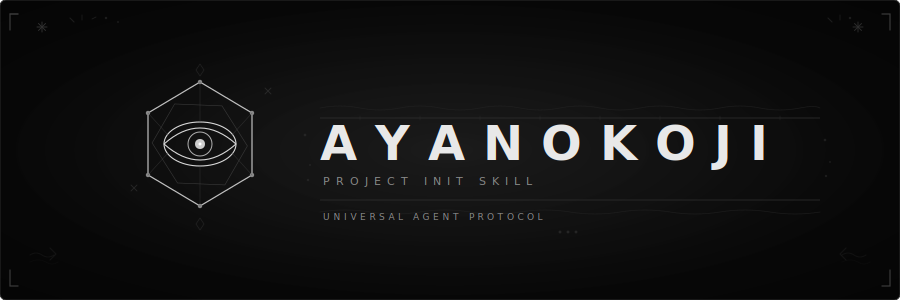
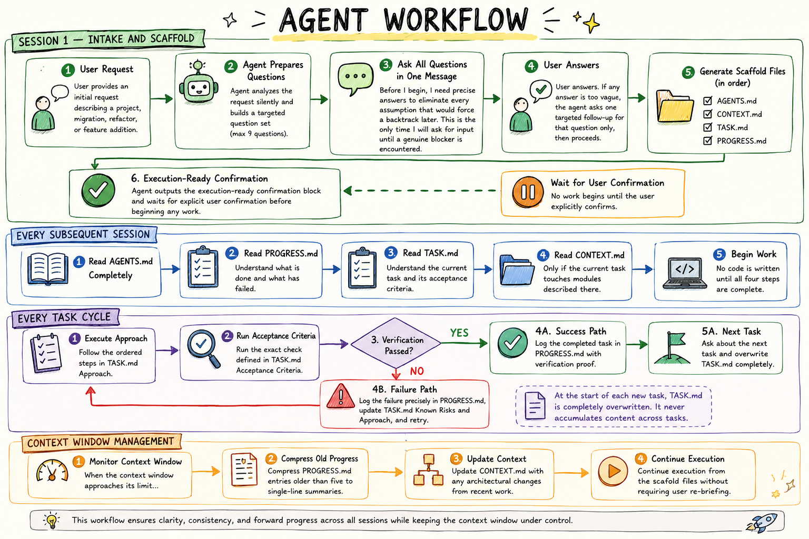

<p align="center">
  
</p>

# Ayanokoji — Strategic Execution Protocol

A universal strategic execution protocol for AI coding agents. It replaces reactive, error-prone behaviors with pre-calculated, structured planning and verification. Works across **Claude Code, Cursor, Windsurf, GitHub Copilot, Cline, Kiro, OpenCode, Hermes**, and any LLM agent.

---

## Key Features

* **Methodical Intake**: The agent silently analyzes tasks and asks at most 9 targeted questions to define the end state, hard constraints, and acceptance criteria before writing any code.
* **Persistent Memory Scaffold**: Generates four root-level markdown files to maintain state across resets:
  * `AGENTS.md` — Rulebook (hard-capped at 60 lines) with constraints and operating principles.
  * `CONTEXT.md` — High-level architecture map and stack definition.
  * `TASK.md` — Bounded mission brief (files in scope, approach, risks, and criteria). Overwritten per task.
  * `PROGRESS.md` — Intelligence log of completions (with proof), failures (with exact errors), and blockers.
* **Mandatory Verification Gate**: Enforces execution of TASK.md's exact acceptance criteria. "Tests passed" is not allowed; concrete command outputs or detailed checks must be logged in PROGRESS.md.
* **Fluff & Slop Control**: Restricts LLM outputs to direct code, plan updates, and answers, forbidding greetings (hi, hello) or verbose explanations of what the code does.

---

## Workflow

<p align="center">
  
</p>

---

## Commands

All commands are available as slash commands, `@mentions`, or natural language directives.

| Command | Action |
|---|---|
| `/ayanokoji` | Activate the strategic execution protocol for this project. |
| `/ayanokoji-task [desc]` | Overwrite and initialize `TASK.md` with the new task description. |
| `/ayanokoji-gate` | Verify the current task's acceptance criteria and update scaffold logs. |
| `/ayanokoji-status` | Display the current task summary, blockers, failures, and scaffold health. |
| `/ayanokoji-review` | Inspect the active `TASK.md` for completeness and risks before starting. |
| `/ayanokoji-audit` | Audit all four scaffold files for protocol compliance and syntax errors. |
| `/ayanokoji-debt` | List all deferred decisions, `[TO BE DEFINED]` blocks, and blockers. |
| `/ayanokoji-gain` | Summarize project stats: completed tasks, retry rate, and verification quality. |
| `/ayanokoji-help` | Display the protocol quick-reference guide. |

*Deactivate by saying `"stop ayanokoji"` or `"normal mode"`.*

## Setup Guide

### Instant Setup (Recommended)
Automatically configure the Ayanokoji ruleset for all detected IDEs in your current project directory with a single command:
```bash
npx ayanokoji.md
```
This command writes the master `AGENTS.md` to your project root and configures the relevant rule files for Cursor, Windsurf, Copilot, Cline, or Kiro based on your project structure.

---

## Manual IDE Setup Guide

### 1. Cursor
Copy the cursor rule to your project:
```bash
mkdir -p .cursor/rules
cp .cursor/rules/ayanokoji.mdc .cursor/rules/ayanokoji.mdc
```
The rule will automatically steer all composer and chat sessions.

### 2. Windsurf
Copy the windsurf rule to your project:
```bash
mkdir -p .windsurf/rules
cp .windsurf/rules/ayanokoji.md .windsurf/rules/ayanokoji.md
```

### 3. Claude Code / Gemini CLI / Antigravity CLI
Install as a plugin:
```bash
claude mcp add ayanokoji https://github.com/Sahnik0/ayanokoji.md
```
Or use the native commands configured in `commands/` and `gemini-extension.json`.

### 4. GitHub Copilot
* **Instruction-tier**: Copy `.github/copilot-instructions.md` to your repository.
* **Plugin-tier**: Add it through the Copilot Plugin Marketplace.

### 5. Cline
Copy the rules file to your project:
```bash
cp .clinerules/ayanokoji.md .clinerules
```

### 6. Kiro
Copy the steering rule:
```bash
mkdir -p .kiro/steering
cp .kiro/steering/ayanokoji.md .kiro/steering/ayanokoji.md
```

### 7. OpenCode
Add the plugin dependency to your `opencode.json`:
```json
{
  "plugins": ["ayanokoji.md"]
}
```

### 8. Hermes Agent
Install and enable the plugin:
```bash
hermes plugins install ayanokoji
hermes plugins enable ayanokoji
```

---

## Project Structure

```
ayanokoji.md/
  ├── AGENTS.md                          — Canonical ruleset (copied by agents)
  ├── skills/                            — Full protocol markdown files
  │   ├── ayanokoji/SKILL.md             — Base strategic protocol
  │   └── ayanokoji-[sub]/SKILL.md       — Sub-skill rules (review, status, etc.)
  ├── commands/                          — Slash command descriptors (.toml)
  ├── hooks/                             — Adapter hooks & scripts for shells/CLIs
  ├── pi-extension/                      — Personal AI (pi) extension files
  ├── scripts/                           — Development lint, build, & sync scripts
  ├── tests/                             — Complete functional unit test suite
  ├── benchmarks/                        — Correctness and LOC graders
  ├── __init__.py                        — Hermes plugin runtime entry
  └── plugin.yaml                        — Hermes plugin manifest
```

---

*"Emotions are inefficiencies. I calculate, therefore I execute."*
